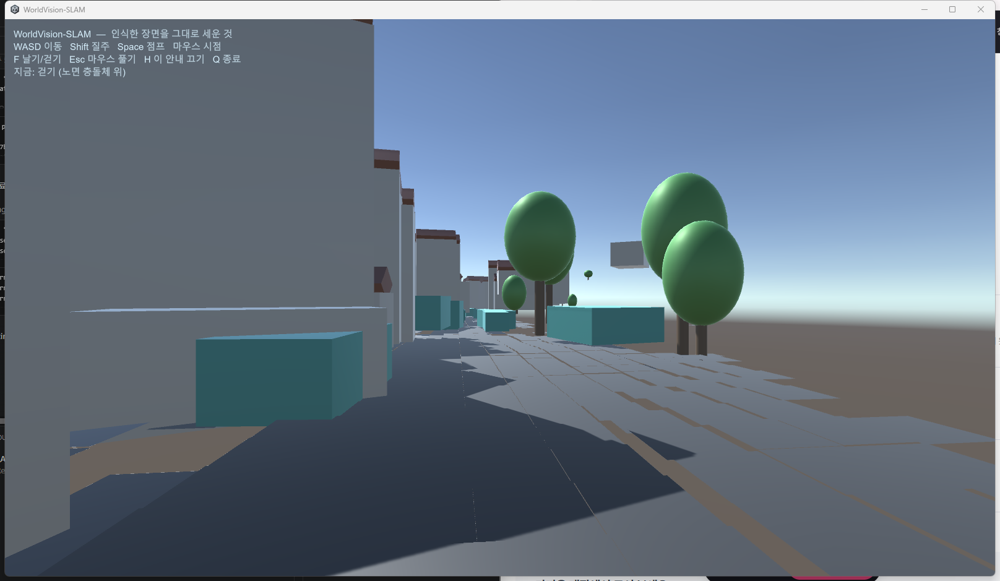

# 인식한 장면을 게임 엔진으로

뷰어가 화면에 그리는 것은 이미 장면 서술이다. 집은 중심·방향·치수·지붕
높이이고, 나무는 자리·높이·수관 반지름이며, 차량은 변환과 크기와 클래스다.
그것을 파일로 내보내면 Unity 나 Unreal 이 받아 재질과 조명을 입힐 수 있다.

## 두 가지 형식

```
wme_bench_viewer --seq 0 --frame 200 \
    --export-scene results/scene/kitti_00.glb \
    --export-json  results/scene/kitti_00.json \
    --screenshot   /tmp/shot.png
```

**`.glb`** — 삼각형을 굳혀 담은 것. 두 엔진이 별도 임포터 없이 읽는다
(Unreal 은 기본 지원, Unity 는 glTFast 또는 UnityGLTF 패키지가 필요하다).
장면을 눈으로 확인하거나 배경으로 한 번 놓을 때 쓴다.

**`.json`** — 무엇이 어디에 얼마만 한가를 적은 것. 50 KB 남짓이다.
아래 임포터가 이것을 읽어 오브젝트를 놓는다.

**둘의 차이는 크기가 아니라 종류다.** GLB 는 집 하나가 커다란 메시의 일부라
충돌체도 재질도 따로 줄 수 없고, 차를 움직이거나 건물을 지울 수도 없다.
JSON 으로 세우면 엔진이 아는 오브젝트가 되므로 그다음은 엔진의 일이 된다.

## 걸어 다닐 수 있는 실행 파일

```
powershell -ExecutionPolicy Bypass -File engine/unity/build.ps1 -Run
```

`build/unity/WorldVision.exe` 가 나온다 (84 MB). 실행하면 자차가 섰던 자리에
서 있게 된다 - **WASD** 이동, **Shift** 질주, **Space** 점프, 마우스 시점,
**F** 날기/걷기, **Esc** 마우스 풀기, **Q** 종료.

임포트와 항공 렌더까지는 보기만 하는 것이었다. 여기서부터는 노면의
`MeshCollider` 와 건물의 `BoxCollider` 가 실제로 쓰인다 - 바닥을 딛고 서고,
벽을 통과하지 못한다.

시작 방향은 고정값이 아니라 **주변 노면 타일의 주축** 에서 구한다. 30 m 안의
타일로 2x2 공분산의 주고유벡터를 잡고, 노면이 더 많이 뻗은 쪽으로 돌린다.
고정 방향을 쓰면 시퀀스마다 담벼락을 보고 시작한다.

자차 자리에서 **3 m 위** 에 놓고 떨어뜨린다. 높이를 딱 맞추면 그 자리에
주차된 차 안에서 시작하는 일이 생긴다.

### 오른쪽 위 시퀀스 이름은 무엇인가

화면 오른쪽 위 목록에 뜨는 이름은 **`wvdata` 안의 파일명 그대로다.**
`Boot.Awake` 가 `wvdata/*.json` 을 훑어 확장자만 떼어 올리고 이름순으로
정렬한다. 그래서 이름을 바꾸는 자리는 산출물이 아니라 **빌드가 복사하면서
붙이는 이름** 이고, 그 대응표는 `engine/unity/wvdata_names.tsv` **한 곳뿐**
이다. `build.ps1` 이 그 표를 읽어 복사할 때 갈아 붙인다 — `wvdata` 를 손으로
고치면 다음 빌드에서 되돌아간다.

| 화면 이름 | 산출물 | 무엇인가 |
|---|---|---|
| `Data_Set_01` | `kitti_00` | KITTI odometry 00 — 주택가, 폐곡선 |
| `Data_Set_02` | `kitti_04` | KITTI odometry 04 — 직선 도로 (자차 높이가 흔들리는 시퀀스다) |
| `Data_Set_03` | `kitti_05` | KITTI odometry 05 — 주택가, 좌회전 구간 |
| `Data_Set_04` | `kitti_07` | KITTI odometry 07 — 시가지, 정지 구간 포함 |
| `Data_Set_05` | `tartanground_downtown_360` | TartanGround Downtown — 360° 등장방형에서 잘라낸 도심 주행 (합성) |

`Data_Set_05` 만 KITTI 가 아니다. 큐브맵 여섯 면을 등장방형 2048×1024 로
합성한 뒤 정면 110° 원근 뷰를 잘라 낸 것이고, 깊이와 포즈는 데이터셋의 렌더
GT 다. 취득 방법·라이선스·합성이 맞다는 실측 근거는
`data/tartanground_downtown_360/SOURCE.md` 와
`python/tools/fetch_tartanground_360.py` 머리말에 있다.

**이 시퀀스의 지도는 아직 좋지 않다.** 40 프레임 · 프레임당 약 1.4 m 구간에서
WME 의 ATE 가 **1251 cm** 다 (같은 구간 ORB + PnP 는 31.58 cm). 지도가 그
궤적으로 쌓이므로 지면이 평면으로 모이지 않고, 재생하면 자차가 지도 위로
떠오른다 — 뷰어의 자차높이 검사가 "궤적과 지도가 같은 지면을 가리키지
않는다" 로 화면에 적는다. `kitti_04` 와 같은 종류의 결함이고, 숨기지 않고
적어 두는 쪽을 택했다. 프레임 간격을 줄이면(같은 궤적을 `--stride 1` 로 다시
받으면) 나아질 것으로 보이지만 **아직 확인하지 않았다.**

**산출물 이름은 바꾸지 않았다.** `results/bench/viewer.tsv` 의 `SEQ` 줄,
`results/bench/*_baseline.txt`, `results/cam/<이름>/`, `results/scene/<이름>.json`
이 전부 그 이름을 물고 있다. 화면 이름만 갈아 끼운다.

**대응은 화면에서도 읽힌다.** 왼쪽 패널 "시퀀스" 칸이 표시 이름 아래
`산출물 kitti_04` 를 함께 적는다 (장면 JSON 의 `sequence` 필드). 표를 펴지
않아도 지금 보고 있는 것이 무엇인지 알 수 있어야 한다.

점군(`.wvpc`)이 있는데 표에 줄이 없는 시퀀스가 나오면 **빌드가 선다.** 그것을
산출물 이름 그대로 실으면 목록에 `Data_Set_03` 옆에 `kitti_09` 가 나란히
서고, 그때는 화면과 표 중 어느 쪽이 맞는지 아무도 모른다.

처음 여는 장면도 같은 이름이어야 한다. `build.ps1` 이 임포터에 `-wvName` 으로
표시 이름을 넘기고 임포터가 그것을 `Boot.sceneName` 으로 직렬화한다. 이것을
빼면 목록에는 `Data_Set_01` 이 떠 있는데 `Boot` 는 `kitti_00.json` 을 찾다
못 찾고 빈 화면으로 시작한다.



## Unity

`engine/unity/Editor/WorldVisionSceneImporter.cs` 를 프로젝트의 아무
`Editor` 폴더에 넣고 메뉴에서 **WorldVision > Import Scene (JSON)**.

기본 도형(Cube/Sphere/Cylinder)만 쓰므로 에셋을 따로 받을 필요가 없고,
셰이더는 URP · HDRP · Built-in 순으로 찾는다. 프리팹으로 바꾸려면 생성된
GameObject 를 교체하면 된다.

좌표는 오른손 +y up 으로 나가고 Unity 는 왼손 +y up 이라 z 를 뒤집는다.
방향 벡터도 같은 변환을 받는다 - 위치만 바꾸면 집이 제자리에 서되 엉뚱한
쪽을 본다.

## Unreal

Output Log (Window > Output Log) 의 Cmd 입력줄에서:

```
py "D:/Program Files/Slam-Model/engine/unreal/import_worldvision_scene.py"
```

다른 장면을 쓰려면 환경변수 `WV_SCENE` 에 경로를 넣는다. 액터는 아웃라이너의
`WorldVision/` 아래에 클래스별 폴더로 묶인다.

언리얼은 왼손계에 **+z 가 위** 이고 단위가 센티미터다. 축을 바꾸고 100 을
곱한다 - 축만 바꾸고 단위를 잊으면 장면이 100 배 작게 들어와 원점의 점처럼
보인다.

## 장면 서술 형식

```json
{
  "format": "worldvision-scene/1",
  "sequence": "kitti_00", "frame": 201,
  "up": "+y", "handedness": "right", "unit": "meter",
  "ego": [x, y, z],
  "buildings": [{"center": [..], "forward": [..], "length": 7.4,
                 "width": 1.4, "height": 3.7, "roof": 0.8, "range": 23.9}],
  "trees":     [{"foot": [..], "height": 6.5, "canopy": 1.8}],
  "poles":     [{"foot": [..], "height": 4.0}],
  "vehicles":  [{"class": "car", "center": [..], "forward": [..],
                 "size": [w, h, l], "seen": 7, "moving": false}],
  "surfaces": {"cell": 0.5, "tiles": [[x, y, z, 밝기, 종류], ...]},
  "road_map": {"image": "kitti_00_road.png", "cell": 0.1,
               "width": 1292, "height": 2472,
               "origin": [..], "axis_u": [..], "axis_v": [..]}
}
```

`surfaces` 는 **딛고 설 수 있는 바닥** 이다. `종류` 는 0 도로 · 1 인도 ·
2 잔디 · 3 기타이고, 엔진은 종류마다 메시와 재질을 따로 만든다 - 차가 굴러가는
아스팔트와 밟고 서는 보도와 잔디가 같은 물성일 수는 없다.

**높이로는 갈리지 않는다.** 연석 단차는 12 cm 인데 스테레오 잡음이 그보다
크다. 갈라 주는 것은 화소의 의미다. SegFormer-B0 이 낸 Cityscapes 라벨을
0.1 m 노면 격자 칸마다 다수결로 쌓고, 0.5 m 로 묶을 때 그 표를 센다. 밝기와
달리 라벨은 가까운 관측이 이기게 두면 안 된다 - 한 프레임의 오분류가 칸을
통째로 뒤집는다.

kitti_00 201 프레임: 도로 9209 · 인도 1441 · 잔디 336 · 기타 1056 타일.
인도로 판정된 타일의 **78 %가 도로에서 1 m 안** 에 있다 - 인도는 길가에
붙어 있어야 하므로, 이 숫자가 낮으면 분류가 흩어졌다는 뜻이다.

`road_map` 은 **차선을 나르는 무늬** 다. 차선은 높이 차이가 0 이라 타일을
아무리 잘게 쪼개도 기하로는 나오지 않고, 잘게 쪼갤수록 JSON 만 커진다.
0.1 m 격자를 PNG 한 장으로 굽고 (1292x2472, 238 KB) 엔진이 노면에 입힌다.
UV 는 타일마다가 아니라 **월드 좌표에서** 뽑는다 - 타일마다 0..1 을 주면 선이
타일 경계마다 끊겨 점선이 된다.

임포터는 그 PNG 에 **감마 0.52 를 먹여** 에셋으로 만든다. 카메라 노출이
하늘에 맞춰져 있어 아스팔트가 40/255 로 찍히는데, 그 값을 albedo 로 쓰면
조명이 다시 곱해져 거의 검게 된다 - 실제 아스팔트 반사율은 0.1~0.2 이지
0.02 가 아니다. 곱셈이 아니라 감마인 이유는, 곱하면 흰 페인트가 먼저 포화해
차선이 노면에 녹기 때문이다 (p50 66 -> 126, p90 167 -> 205).

`range` 는 그 집을 **가장 가까이서 본 거리** 다. 스테레오 깊이 오차는 거리의
제곱으로 커지므로 (30 m 에서 약 1.2 m), 먼 것만 걸러 쓰고 싶으면 이 값으로
거른다. 뷰어는 30 m 를 넘는 것을 이미 빼고 내보낸다.

`moving` 은 클래스가 아니라 **관측** 에서 나온 판정이다. 주차된 차와 지나간
차를 가를 때 쓴다.

## 확인한 것

**Unity 에서 실제로 돌렸다.** Hub 3.20.1 과 에디터 6000.0.81f1 을 설치하고
배치 모드로 임포트해 씬을 저장했다:

```
Unity.exe -batchmode -quit -nographics -projectPath engine/unity/Project   -executeMethod WorldVision.SceneImporter.ImportFromCommandLine   -wvScene results/scene/kitti_00.json
```

종료 코드 0, 로그에 `kitti_00 프레임 201 - 건물 237, 나무 56, 기둥 1, 차량 46`.
저장된 `WorldVisionScene.unity` 를 세어 보면:

| | |
|---|---|
| GameObject / Transform | 614 / 614 |
| MeshFilter | 609 |
| 콜라이더 | Box 496 · Sphere 56 · Capsule 57 |
| 이름별 | Building 237 · Roof 213 · Canopy 56 · Trunk 56 · car 37 · car (moving) 8 · Road/Sidewalk/Grass/Ground |

지붕이 건물보다 24 개 적은 것은 맞다 - 높이 2.5 m 미만에는 박공을 얹지
않는다. 콜라이더가 전부 붙어 있으므로 보이기만 하는 것이 아니라 물리가 있는
오브젝트다.

**GLB** 는 규격에 맞는지 검사했다 - 청크 길이, 선언한 버퍼 크기 대 실제 청크,
모든 접근자의 count 대 bufferView 바이트 길이.

**좌표 변환** 은 실제 데이터로 확인했다 (kitti_00 201 프레임):

| 검사 | 결과 |
|---|---|
| NaN / Inf 좌표 | 0 |
| 단위벡터가 아닌 forward | 0 (건물 237, 차량 46 전부) |
| 변환 전후 상호 거리 변화 | 0.000000 m |
| Unity 좌표 범위 | x -86.9..25.2, y -0.3..15.1, z 18.5..255.3 m |

거리가 그대로인 것이 중요하다 - z 뒤집기는 거울이라 손 방향만 바뀌고 형상은
보존되어야 한다. 값이 달라졌다면 축을 잘못 섞은 것이다.

노면은 1 m 타일 3332 개짜리 메시 하나다. 밝기 분포는 어두운 아스팔트가
72.2 %, 가장 밝은 단계 (차선·연석) 가 2.0 % 로, 도료가 노면보다 훨씬 밝게
되돌아온다는 것과 맞는다. `MeshCollider` 가 붙어 있으므로 차를 올리면 선다.

`engine/unity/Check/check.ps1` 은 Unity 없이도 임포터가 컴파일되는지 본다.
설치가 없는 환경에서 회귀를 잡으려고 남겨 둔다.

## 아직 확인하지 못한 것

**Unreal 임포터는 돌려 보지 못했다.** 언리얼은 여기 설치되어 있지 않다.
문법과 좌표 산술은 확인했지만 그뿐이다.

**눈으로 봐야 아는 것** - 조명, 재질, 스케일 감각, 건물이 정말 카메라가 본
자리에 서는지 - 은 에디터를 열어 봐야 한다. 위 숫자들이 말하는 것은 오브젝트가
제 개수만큼, 제 치수로, 물리를 갖고 섰다는 것까지다.
